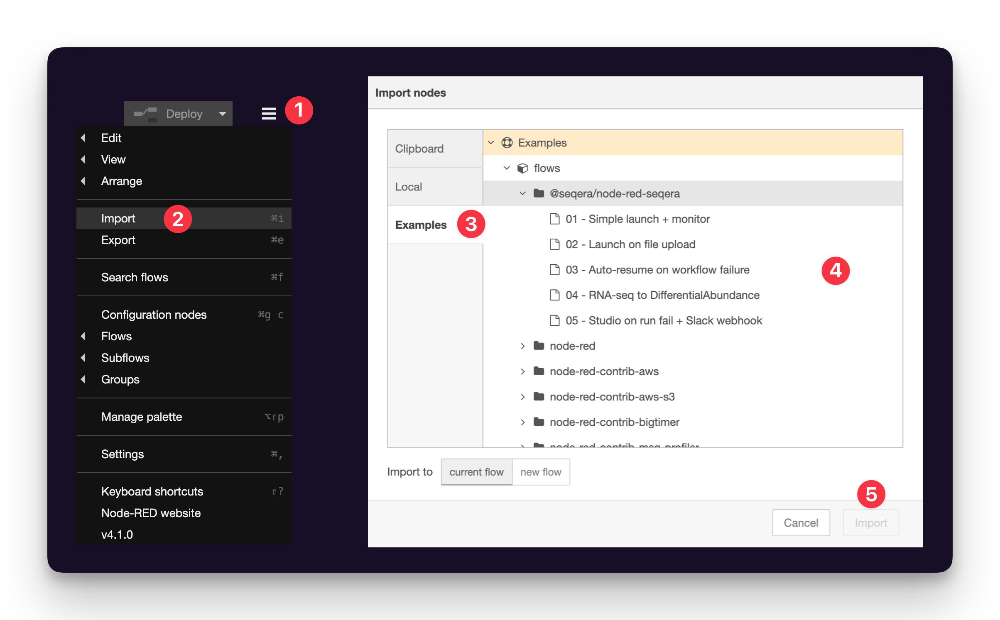
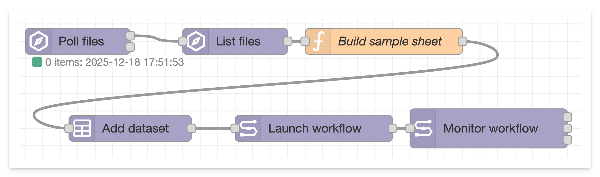
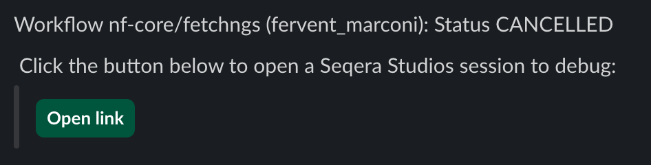

# Node-RED + Seqera: Examples

You can find the Seqera nodes in the sidebar on the left, under the heading "Seqera". To jump-start your development, take a look at the examples that come with the extension:

- Menu (top right `≡` button)
- Import
- Examples (modal's left sidebar)
- @seqera/node-red-seqera dropdown
- Choose an example and import into your current workflow

## 01 - Simple launch & monitor

`examples/01 - Simple launch + monitor.json`

This is the most basic example workflow that demonstrates the core _Launch workflow_ and _Monitor workflow_ nodes.

The flow consists of a simple sequence:

1. **Manual trigger** - Click the inject node to start the process
2. **Launch workflow** - Launches a pipeline using a Seqera Platform Launchpad configuration
3. **Monitor workflow** - Continuously polls the workflow status until completion
4. **Debug outputs** - Shows the running status updates and final completion message

### Setup

To get this example working, you'll need to configure:

- **Seqera configuration** - Add your Platform API token and endpoint to both Seqera nodes
- **Launch workflow node** - Set the correct launchpad name and update any pipeline parameters as needed

Once configured, click "Deploy" in Node-RED, then click the inject node to trigger a workflow launch. You can follow the progress in the Debug panel on the right sidebar.

## 02 - Launch on file upload

`examples/02 - Launch on file upload.json`

This flow uses the _Poll files_ node to periodically check for the presence
of a file called `RTAcomplete.txt` within a Seqera Data Link (eg. an s3 bucket).

These files are typically uploaded by illumina sequencers when base calling is complete.
But you could configure it to look for the upload of any file path.

When the file is detected, a _List files_ node is used to list all of the files within
that Data Link (bucket - could be configured to use the location that the `RTAcomplete.txt` file is found).

A Node-RED _Function_ node with some javascript then constructs a sample sheet from these filenames.
This is passed to the "Create Dataset" node, which saves it as a Seqera Platform Dataset.

Finally, this is passed to the _Launch workflow_ node, which fires off a pipeline run.

### Setup

Some configuration is needed to make this flow work:

- All Seqera nodes need a Seqera configuration to be assigned
- _Poll files_ and _List files_ need to be configured with the name of a Data Link within Platform
- _Create dataset_ needs a dataset name to be set somehow (dynamically to avoid name clashes)
- _Launch workflow_ needs configuring with the name of a Launchpad pipeline, and parameters.

## 03 - Pipeline → Create Studio → Slack webhook

`examples/03 - Studio on run fail + Slack webhook.json`

This workflow has three parts to it:

1. Launch and monitor a workflow
   - Just a manual click trigger, in reality you should set this up to some other automation
2. On failure, create a Seqera Studio
   - Create + start a Studio with VSCode and the Data Link mounted
3. Send a message to a Slack workflow webhook
   - Includes workflow status and a button that links to either the workflow run details (on success) or the new Seqera Studios for debugging (on failure)
   - Could equally be any other webhook

If all goes well, you'll get messages in Slack that look like this:

Clicking "Open link" will take you directly to a Studio running VS Code, with your pipeline's work directory mounted and ready to debug.

### Setup

This workflow needs some setup:

- All Seqera nodes need a Seqera configuration to be assigned
- Data Links, Pipelines, and Compute Environments need to be added to nodes
- Slack workflow needs to be created and webook URL entered.

To make the automated Slack message, first you need to create a Slack Workflow.
Selelct _"From a webhook"_ as the trigger:

Then configure with some input variables and a button, and copy the webhook URL. You'll need this later!

## 04 - RNA-seq → Differential Abundance

`examples/04 - RNA-seq to DifferentialAbundance.json`

This workflow demonstrates chaining nf-core/rnaseq and nf-core/differentialabundance pipelines together.

The workflow launches nf-core/rnaseq with a user-provided samplesheet and monitors its execution. When RNA-seq completes successfully, it automatically constructs file paths to the output count matrices (`salmon.merged.gene_counts.tsv` and `salmon.merged.gene_lengths.tsv`) and launches nf-core/differentialabundance with these files as inputs.

The output directory is automatically generated from the CSV filename, and all parameters are configured via a single function node at the start.

### Setup

This workflow comes **pre-configured with test data** and works out of the box!

- All Seqera nodes need a Seqera configuration to be assigned
- Two Launchpad entries are required: `nf-core-rnaseq` and `nf-core-differentialabundance`
- Open the **"Set user inputs"** function node to configure file paths
- The workflow uses small test data from this repository: S. cerevisiae (yeast) RNA-seq with ~7 samples

**Test files (GitHub-hosted):**

- Samplesheet: `examples/data/rnaseq-tests-datasets.csv` - includes `sample`, `fastq_1`, `fastq_2`, `strandedness`, `treatment`, and `replicate` columns
- Contrasts: `examples/data/rnaseq-test-contrasts.csv` - defines comparisons like WT vs RAP1_UNINDUCED
- Genome: `R64-1-1` (S. cerevisiae from iGenomes)

**To use your own data**, edit the function node:

- Set `msg.rnaseqSamplesheet` to your samplesheet path (must include a grouping column like `treatment` or `group`)
- Set `msg.contrastsCSV` to your contrasts file
- Set `msg.basePath` to your output location (e.g., `s3://my-bucket/results`)
- Set `msg.genome` or provide explicit `msg.gtfFile` and `msg.fasta` paths

## 05 - Auto-resume on workflow failure

`examples/05 - Auto-resume on workflow failure.json`

This workflow demonstrates how to automatically resume a failed Nextflow workflow using the workflow ID from the failed run. This pattern is useful for recovering from transient errors without re-running successfully completed tasks.

The flow implements an automatic resume pattern:

1. **Initial Launch** - A workflow is launched using the Launch workflow node
2. **Monitor** - The workflow is continuously monitored for completion
3. **Failure Detection** - If the workflow fails (output port 3 of the monitor node), the failure path is triggered
4. **Extract Workflow ID** - The workflow ID is available in `msg.workflowId` from the monitor node output
5. **Resume Launch** - The Launch workflow node is triggered with:
   - The workflow ID set in the "Resume from" field (reading from `msg.workflowId`)
   - The node automatically fetches the session ID and commit hash
   - If the previous workflow ran tasks, resume is enabled to skip completed work
   - If the workflow was cancelled before tasks ran, it relaunches from the start
6. **Monitor Resumed** - The resumed workflow is monitored for completion

### Setup

To use this example:

- Configure all Seqera nodes with your Platform credentials
- Set the launchpad name in the Launch workflow node
- Configure the "Resume from" field to use `msg.workflowId` from the monitor output
- Adjust parameters as needed
- Click "Deploy" and trigger with the inject node

If your workflow succeeds on the first try, the resume logic won't be triggered. If it fails, the flow will automatically attempt to resume from the failure point.
