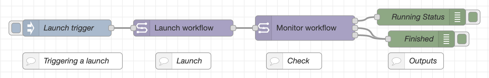

# Simple launch & monitor

`examples/01 - Simple launch + monitor.json`

<iframe width="560" height="315" src="https://www.youtube.com/embed/7ieTV3fhV4Y?si=ETb-0S4G-W7MEC1T" title="YouTube video player" frameborder="0" allow="accelerometer; autoplay; clipboard-write; encrypted-media; gyroscope; picture-in-picture; web-share" referrerpolicy="strict-origin-when-cross-origin" allowfullscreen></iframe>

This is the most basic example workflow that demonstrates the core _Launch workflow_ and _Monitor workflow_ nodes.

The flow consists of a simple sequence:

1. **Manual trigger** - Click the inject node to start the process
2. **Launch workflow** - Launches a pipeline using a Seqera Platform Launchpad configuration
3. **Monitor workflow** - Continuously polls the workflow status until completion
4. **Debug outputs** - Shows the running status updates and final completion message

## Setup

To get this example working, you'll need to configure:

-   **Seqera configuration** - Add your Platform API token and endpoint to both Seqera nodes
-   **Launch workflow node** - Set the correct launchpad name and update any pipeline parameters as needed

Once configured, click "Deploy" in Node-RED, then click the inject node to trigger a workflow launch. You can follow the progress in the Debug panel on the right sidebar.
