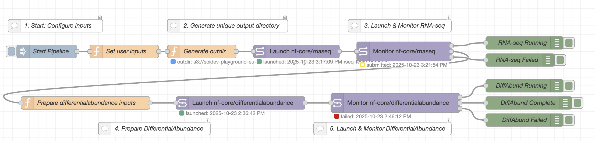

# Pipeline Chaining: RNA-seq → Differential Abundance

`examples/04 - RNA-seq to DifferentialAbundance.json`

<iframe width="560" height="315" src="https://www.youtube.com/embed/C0_JzIfzBUs?si=v9buvPV00BhZPdXV&amp;start=235" title="YouTube video player" frameborder="0" allow="accelerometer; autoplay; clipboard-write; encrypted-media; gyroscope; picture-in-picture; web-share" referrerpolicy="strict-origin-when-cross-origin" allowfullscreen></iframe>

This workflow demonstrates chaining nf-core/rnaseq and nf-core/differentialabundance pipelines together.

The workflow launches nf-core/rnaseq with a user-provided samplesheet and monitors its execution. When RNA-seq completes successfully, it automatically constructs file paths to the output count matrices (`salmon.merged.gene_counts.tsv` and `salmon.merged.gene_lengths.tsv`) and launches nf-core/differentialabundance with these files as inputs.

The output directory is automatically generated from the CSV filename, and all parameters are configured via a single function node at the start.

## Setup

This workflow comes **pre-configured with test data** and works out of the box!

-   All Seqera nodes need a Seqera configuration to be assigned
-   Two Launchpad entries are required: `nf-core-rnaseq` and `nf-core-differentialabundance`
-   Open the **"Set user inputs"** function node to configure file paths
-   The workflow uses small test data from this repository: S. cerevisiae (yeast) RNA-seq with ~7 samples

**Test files (GitHub-hosted):**

-   Samplesheet: `docs/examples/data/rnaseq-tests-datasets.csv` - includes `sample`, `fastq_1`, `fastq_2`, `strandedness`, `treatment`, and `replicate` columns
-   Contrasts: `docs/examples/data/rnaseq-test-contrasts.csv` - defines comparisons like WT vs RAP1_UNINDUCED
-   Genome: `R64-1-1` (S. cerevisiae from iGenomes)

**To use your own data**, edit the function node:

-   Set `msg.rnaseqSamplesheet` to your samplesheet path (must include a grouping column like `treatment` or `group`)
-   Set `msg.contrastsCSV` to your contrasts file
-   Set `msg.basePath` to your output location (e.g., `s3://my-bucket/results`)
-   Set `msg.genome` or provide explicit `msg.gtfFile` and `msg.fasta` paths
