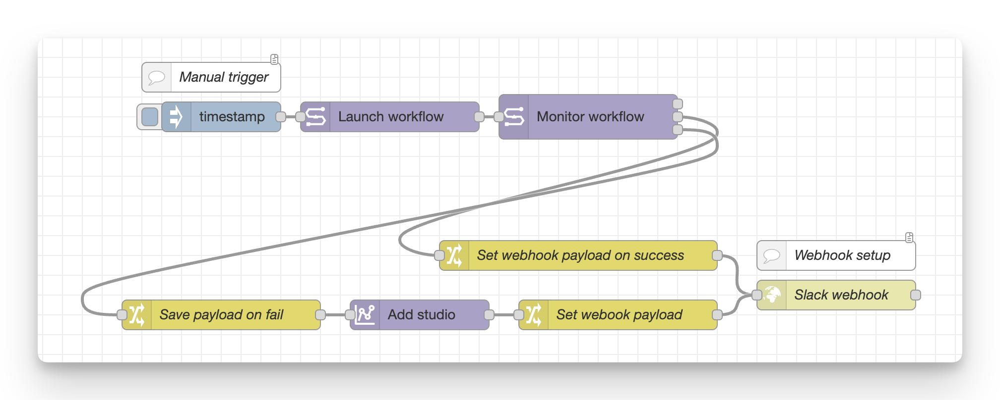
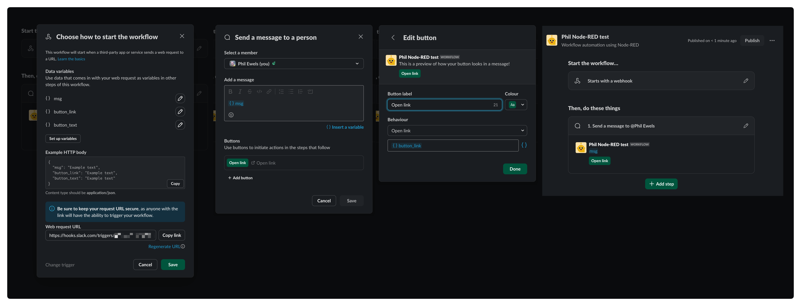

# Pipeline → Add Studio → Slack webhook

`examples/05 - Studio on run fail + Slack webhook.json`



!!! example "In development"

    This example is still in development and needs some work:

    - Pre-configure the mounting of the work directory from the failed task into the studio automatically.
    - Use a _Monitor Studio_ node to wait until the studio is running before sending the Slack notification.

    Contributions welcome!

This workflow demonstrates intelligent failure handling with automated debugging setup and Slack notifications. It launches a workflow, monitors its execution, and sends contextualized Slack messages with direct links - either to the successful run or to a freshly provisioned Seqera Studio for debugging failures.

## Overview

This workflow has three parts to it:

1. Launch and monitor a workflow
    - Just a manual click trigger, in reality you should set this up to some other automation
2. On failure, add a Seqera Studio
    - Add + start a Studio with VSCode and the Data Link mounted
3. Send a message to a Slack workflow webhook
    - Includes workflow status and a button that links to either the workflow run details (on success) or the new Seqera Studios for debugging (on failure)
    - Could equally be any other webhook

If all goes well, you'll get messages in Slack that look like this:


Clicking "Open link" will take you directly to a Studio running VS Code, with your pipeline's work directory mounted and ready to debug.

## How it Works

### 1. Workflow Launch & Monitoring

The flow starts with a manual inject node (click trigger) that launches a workflow via the **Launch workflow** node. The workflow ID is automatically passed to the **Monitor workflow** node, which polls the workflow status every 5 seconds.

The monitor node has three outputs:

-   **Output 1** (Active): Fires while workflow is running (unused in this example)
-   **Output 2** (Succeeded): Fires when workflow completes successfully
-   **Output 3** (Failed): Fires when workflow fails, cancelled, or errors

### 2. Success Path → Direct Link

When the workflow succeeds, the message flows to the **"Set webhook payload on success"** change node, which uses JSONata to construct a Slack message:

```json
{
    "msg": "Workflow " & payload.workflow.projectName & " (" & payload.workflow.runName & "): Status " & payload.workflow.status & "\n\n Click the button below to view the workflow:",
    "button_link": "https://cloud.seqera.io/orgs/" & payload.orgName & "/workspaces/" & payload.workspaceName & "/watch/" & payload.workflow.id
}
```

This creates a deep link directly to the workflow run page in Seqera Platform.

### 3. Failure Path → Studio Creation

When the workflow fails, a more sophisticated sequence occurs:

1. **Save workflow context:**

    - The **"Save payload on fail"** change node stores the workflow output in flow context (`flow.workflow_output`) so it can be referenced later, after the Studio is created.

1. **Create debugging Studio:**

    - The **Add Studio** node provisions a new Seqera Studio with:
        - **Name**: Generated dynamically using JSONata: `"debug-pipeline-run-" & payload.workflow.id`
        - **Container**: VS Code (`public.cr.seqera.io/platform/data-studio-vscode:1.93.1-0.8`)
        - **Resources**: 2 CPU, 8GB memory
        - **Auto-start**: Enabled (Studio starts immediately)
        - **Mount Data**: Configure this to mount the Data Link containing your workflow's work directory

1. **Build Slack message with Studio link:**

    - The **"Set webhook payload"** change node retrieves the saved workflow info from flow context and combines it with the newly created Studio URL:

        ```json
        {
            "msg": "Workflow " & $flowContext("workflow_output.workflow.projectName") & " (" & $flowContext("workflow_output.workflow.runName") & "): Status " & $flowContext("workflow_output.workflow.status") & "\n\n Click the button below to open a Seqera Studios session to debug:",
            "button_link": payload.studio.studioUrl
        }
        ```

### 4. Slack Webhook Notification

Both success and failure paths converge at the **Slack webhook** HTTP request node, which POSTs the payload to your Slack webhook URL. The Slack workflow receives the `msg` and `button_link` fields and displays them as a formatted message with an actionable button.

## Setup

This workflow needs some setup:

### 1. Configure Seqera Nodes

-   All Seqera nodes need a Seqera configuration to be assigned
-   Set the **Launchpad** name in the Launch workflow node (or provide pipeline URL and compute environment)
-   Set the **Compute Environment ID** in the Add Studio node
-   Configure **Mount Data** in the Add Studio node to mount the Data Link containing your workflow work directory

!!! example "Help wanted"

    This _Configure Mount Data_ is the bit that we should be able to do a better job of including in the example 👆🏻

### 2. Create Slack Workflow

To enable automated Slack notifications, you need to create a Slack Workflow with a webhook trigger:

1. Create a new workflow in Slack and select _"From a webhook"_ as the trigger:
   

1. Configure the workflow with two input variables and a button action:

    

    - Your Slack workflow should have:

        - **Variable 1**: `msg` (text) - The notification message
        - **Variable 2**: `button_link` (text) - The URL for the action button
        - **Action**: Send message with button linking to `button_link`

1. Copy the webhook URL provided by Slack.

### 3. Configure Webhook URL

Paste the Slack webhook URL into the **"Slack webhook"** HTTP request node in the Node-RED flow. The request should be configured as:

-   **Method**: `POST`
-   **URL**: Your Slack webhook URL
-   **Return**: `a UTF-8 string`

## Testing

To test the workflow:

1. **Deploy** the flow in Node-RED
2. Click the blue square on the inject node to manually trigger
3. Wait for the workflow to complete
4. Check Slack for the notification:
    - **Success**: Message with link to workflow run page
    - **Failure**: Message with link to a running VS Code Studio session

## Customization

This pattern can be adapted for other use cases:

-   **Different notification systems**: Replace the Slack webhook with Discord, Microsoft Teams, PagerDuty, etc.
-   **Studio container**: Change the container image to RStudio, JupyterLab, or custom images
-   **Conditional Studio creation**: Add a switch node to only create Studios for specific failure types
-   **Studio lifecycle**: Add a lifespan to auto-terminate Studios after a set period (configure in Add Studio node)
-   **Mount multiple Data Links**: Add additional mount points to access reference data or shared resources
-   **Email notifications**: Use an email node instead of webhooks for notifications
