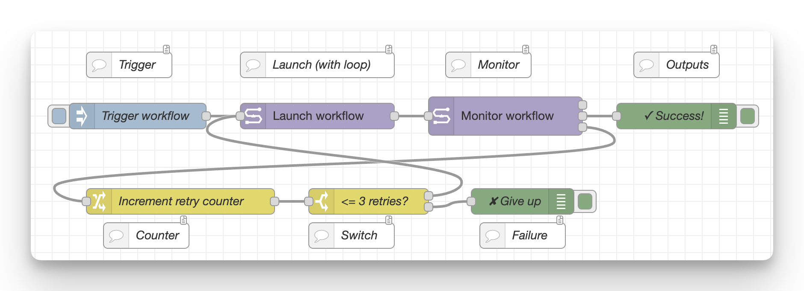

# Pipeline → Add Studio → Slack webhook

`examples/05 - Studio on run fail + Slack webhook.json`

This workflow has three parts to it:

1. Launch and monitor a workflow
    - Just a manual click trigger, in reality you should set this up to some other automation
2. On failure, add a Seqera Studio
    - Add + start a Studio with VSCode and the Data Link mounted
3. Send a message to a Slack workflow webhook
    - Includes workflow status and a button that links to either the workflow run details (on success) or the new Seqera Studios for debugging (on failure)
    - Could equally be any other webhook

If all goes well, you'll get messages in Slack that look like this:

Clicking "Open link" will take you directly to a Studio running VS Code, with your pipeline's work directory mounted and ready to debug.

## Setup

This workflow needs some setup:

-   All Seqera nodes need a Seqera configuration to be assigned
-   Data Links, Pipelines, and Compute Environments need to be added to nodes
-   Slack workflow needs to be created and webook URL entered.

To make the automated Slack message, first you need to create a Slack Workflow.
Selelct _"From a webhook"_ as the trigger:

Then configure with some input variables and a button, and copy the webhook URL. You'll need this later!

