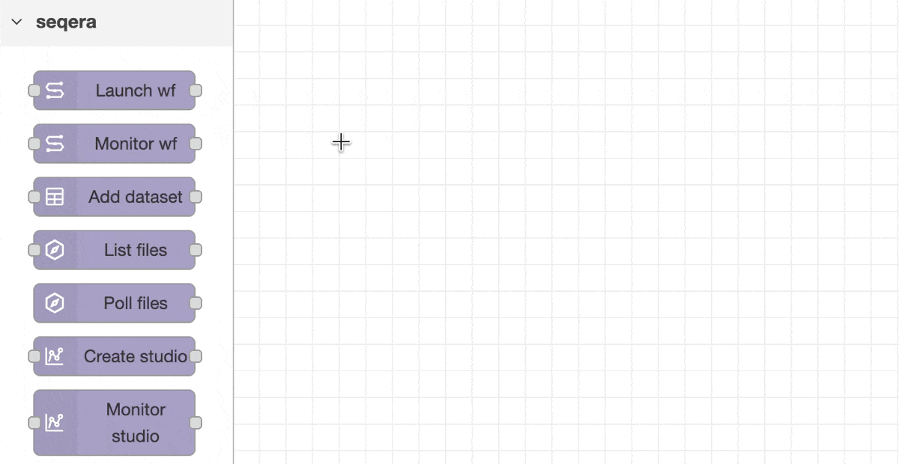
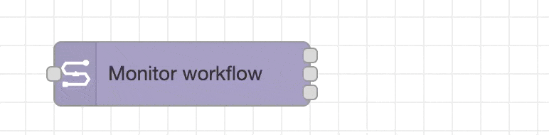
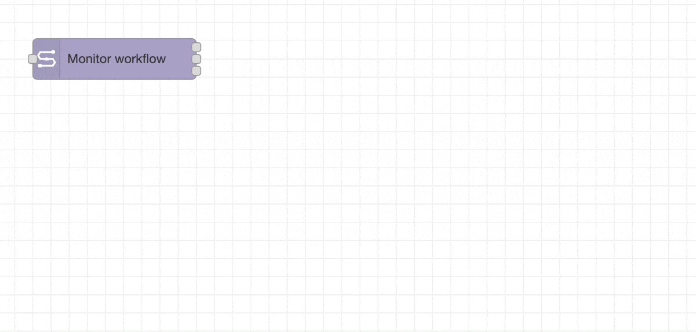
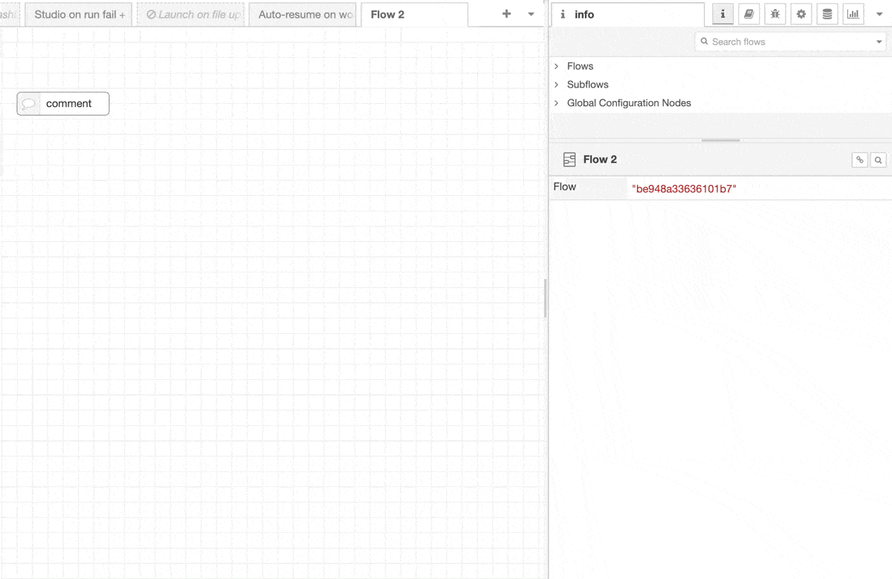
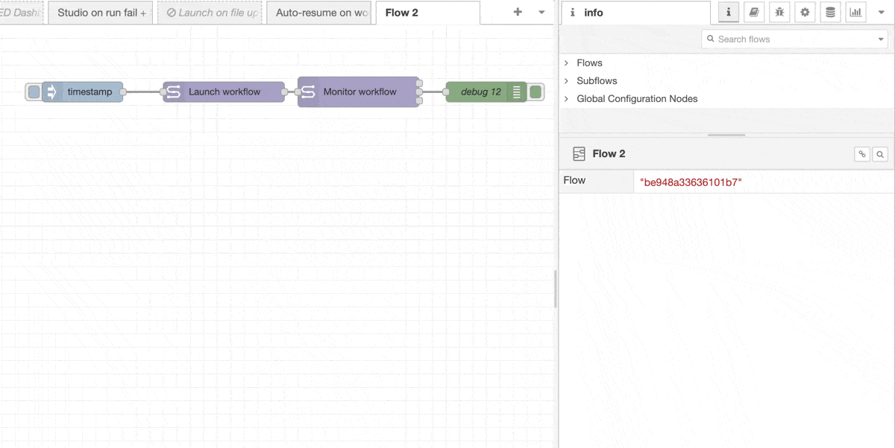
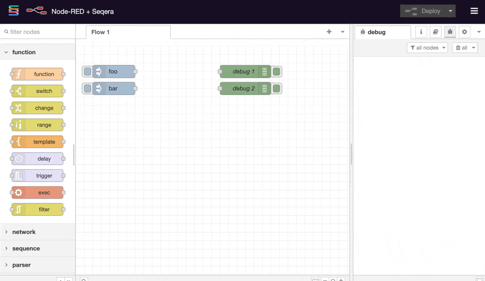

# Node-RED fundamentals

This guide introduces the basics of working with Node-RED.

!!! info "Prerequisites"

    This guide assumes you have already installed Node-RED with the Seqera nodes. If not, see the [Installation](installation.md) guide.

<div class="video-wrapper">
<iframe width="560" height="315" src="https://www.youtube.com/embed/gqdccKWLLzM?si=dqq0N9g70VEJozD5" title="YouTube video player" frameborder="0" allow="accelerometer; autoplay; clipboard-write; encrypted-media; gyroscope; picture-in-picture; web-share" referrerpolicy="strict-origin-when-cross-origin" allowfullscreen></iframe>
</div>

Node-RED is an event-driven automation platform that uses a visual flow-based programming model. You build automation workflows by dragging _nodes_ onto a canvas and wiring them together.

Each node performs a specific task - triggering on events, transforming data, calling APIs, or taking actions. When a message passes through a node, it can be modified and passed to the next node in the chain.

<figure markdown="span">
    
</figure>

## The Node-RED interface

The Node-RED editor has three main sections:

-   **Left sidebar**: Palette of available nodes organized by category
-   **Center canvas**: Visual workspace where you build your flows
-   **Right sidebar**: Context panel showing help, debug messages, and node configuration

!!! tip

    { width="200" align=right }
    The sidebar panels can be resized and minimised.

    Once minimised the handle to show them again is rather small - if one vanishes, try hovering the mouse over to find the button.

### Left sidebar

The left sidebar contains the **node palette** - a searchable list of all available nodes organized by category. Common categories include:

-   **Common**: Basic nodes like inject, debug, function, and switch
-   **Seqera**: All Seqera Platform nodes (after installation)
-   **Network**: HTTP request, WebSocket, MQTT, and other protocol nodes
-   **Storage**: File operations and database nodes

Use the search box at the top to quickly find nodes by name or description.

### Canvas

The canvas is your visual workspace where you build flows by connecting nodes together.

Use the canvas toolbar (bottom-right) to zoom in/out and fit your flow to the screen. You can also use your mouse wheel to zoom.

#### Flows

A _flow_ is the canvas page that you're working on. You can have multiple flows organized in separate tabs, along the top of the page.

If you double click a flow tab you can edit its name and description. The description markdown is rendered in the _info_ tab in the right sidebar. You can also enable / disable and lock editing for entire flows from the edit modal.

#### Dragging nodes onto the canvas

Click and drag any node from the palette onto the canvas to add it to your flow.

#### Connecting nodes

Click and drag from a node's output port (small square on the right edge) to another node's input port (left edge). This creates a wire that passes messages between nodes.



!!! tip

    { width="350" align=right }
    Hovering over a node usually tells you what it does

#### Dragging a node edge out

When you drag from an output port without targeting a specific node, Node-RED shows a **quick-add menu** suggesting relevant nodes to connect. This is a fast way to build flows without searching the palette.



#### Comments

Add comment nodes from the palette (under Common) to annotate your flows. Comments help document what different sections of your flow do - especially useful when sharing flows or returning to them later.

Double click to open in the sidebar and add more content. You can write markdown here, which renders in the _Info_ tab in the right hand sidebar.



#### Grouping

Select multiple nodes and right-click > **Group selection** to create a visual group. Groups can be labeled and colored to help organize complex flows into logical sections.


!!! example "Subflows"

    To go one step further than groups, use _Subflows_ in the main dropdown menu.
    These collapse multiple nodes into a single reusable node with an editable template.
    Great if you find yourself repeating the same logic many times, or to simplify a complex flow!

## Sidebar

The right sidebar has several useful tabs:

-   **Info**: Shows documentation for the selected node
-   **Help**: Show contextual help for the selected canvas element
-   **Debug**: Displays messages sent to debug nodes
-   **Context**: View and edit flow and global variables

### Built-in help

Every node includes built-in documentation. Select any node on the canvas and click the **Help** tab in the right sidebar to see:

-   What the node does
-   Required configuration
-   Input/output message format
-   Usage examples

The Seqera nodes all have detailed help text explaining their configuration options and message properties.



!!! tip

    The contextual help is one of Node-RED's superpowers!

    Get used to checking it as you build flows, most common questions and use cases are described there.

## Common Node-RED nodes

### Inject and Debug

The two most important nodes when learning Node-RED:

#### Inject node

Triggers a flow manually or on a schedule. Click the button on the left side of the node to manually send a message. Use this to test your flows, injecting events on demand to trigger runs.

You often won't care what the payload is, and the default timestamp is fine.
However, double clicking allows you to edit the node and provide custom payloads.

#### Debug node

Outputs message contents to the Debug sidebar. By default it shows `msg.payload`, but you can configure it to show any message property or the complete message object.

!!! tip

    Hovering over a debug output in the sidebar highlights the node it came from with an orange border.
    This is useful if you have multiple debug nodes all producing outputs.

!!! example "Try it now"

    1. Drag an **inject** node and a **debug** node onto the canvas
    2. Wire them together by dragging from the output port (right side) to the input port (left side)
    3. Click **Deploy** in the top-right corner
    4. Click the inject node's button
    5. Check the **Debug** tab in the right sidebar to see the message

    

### Switch, Change and Function

These three core nodes are important for building logic and transforming data in your flows, and start to be important as your flows become more complex.

#### Switch

The **switch** node routes messages to different outputs based on rules you define. Think of it as an if/else statement or case/switch in programming.

The switch node can evaluate message properties against various rules: equals, contains, greater than, matches regex, and more. Each rule corresponds to an output port.



#### Change

The **change** node modifies message properties without writing code. It's perfect for simple transformations and renaming flow variables.

You can chain multiple change rules in a single node. This is cleaner than writing a function node for simple operations.


#### Function

The **function** node lets you write custom JavaScript to transform messages. This is where you have full control.

The basic template:

```javascript
// msg contains the incoming message
// You can access any property: msg.payload, msg.workflowId, etc.

// Do your processing
msg.payload = msg.payload.toUpperCase();

// Return the message (or array of messages for multiple outputs)
return msg;
```

!!! tip

    LLMs such as Claude and ChatGPT are _very good_ at writing custom Javascript functions :wink:

Remember that each function node execution is isolated. Use `context` or `flow` to store data between messages, or `global` to share across your entire Node-RED instance.

Flows can often support multiple event loops at once, it's often good practice to pass variables through the node graph using custom `msg` properties so that variables stay associated with the events themselves.

!!! note "When to use Function vs Change"

    Use **Change** for simple property manipulation - it's faster to configure and easier to maintain. Use **Function** when you need:

    - Complex logic or calculations
    - Loops and conditionals
    - String parsing or manipulation beyond search/replace
    - Working with APIs or libraries (you can `require()` Node.js modules)

## Importing and exporting JSON

Node-RED flows are stored as JSON. You can share flows by copying the JSON representation.

### Importing a flow

1. Either:
    - Go to the hamburger menu (top-right) > **Import**
    - Right click the canvas, then **Insert** > **Import**
    - Keyboard shortcut ++cmd+i++
2. Paste the JSON or select a file
3. Click **Import**

!!! tip "Example flows"

    The Seqera nodes include pre-built example flows. Go to **Import** > **Examples** > **flows** > **@seqera/node-red-seqera** to browse and import them.

### Exporting a flow

1. Select the nodes you want to export (or select none to export all nodes)
2. Either:
    - Go to the hamburger menu > **Export**
    - Right click the canvas, then **Export**
    - Keyboard shortcut ++cmd+e++
3. Choose the tab/flow to export
4. Copy the JSON or download as a file

!!! tip "Working with LLMs"

    Node-RED has been around for a long time, plus flows are JSON-based and well-documented. This makes them excellent candidates for AI assistance. When working with ChatGPT, Claude, or other LLMs:

    - **Copy and paste flows**: Export your flow as JSON and paste it into the conversation to get help debugging or extending it
    - **Generate flows**: Describe what you want to automate and ask the LLM to generate the flow JSON
    - **Reference documentation**: The LLM can read the node help text and suggest configurations

    Combine JSON exports with debug outputs (the sidebar has an icon to copy debug blocks in one click) for help with debugging flows that aren't working as you expect.

## Message property passthrough

Most Node-RED nodes will ignore unrecognised input `msg` properties and _pass them through_ to their outputs.
All Seqera nodes do this.

This is a powerful feature that allows you to maintain context and track messages through complex flows without modifying node code.
You can use `msg._context` (or any custom properties) to maintain state across nodes, which is especially useful in complex flows with parallel branches or multiple event sources.

For example:

```javascript title="Input message to a workflow-launch node"
{
  _context: { requestId: "abc123", source: "webhook" },
  correlationId: "order-789",
  payload: { /* launch parameters */ }
}
```

```javascript title="Output message from the workflow-launch node"
{
  _context: { requestId: "abc123", source: "webhook" },  // Preserved
  correlationId: "order-789",                            // Preserved
  payload: { /* API response */ },                       // Overwritten
  workflowId: "xyz456"                                   // Added by node
}
```

The [auto-resume on failure example](examples/03-auto-resume-on-failure.md) example workflow uses this behaviour to keep track of the number of retry attempts.
This works even when multiple different pipelines have been triggered in the same flow, as the retry counter travels with the node events.
