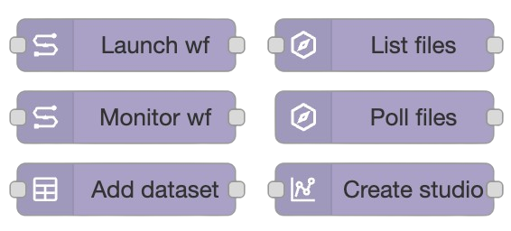

# {width=650} {width=650}

**A set of Node-RED nodes for interacting with Seqera Platform.**

-    GitHub: [seqeralabs/node-red-seqera](https://github.com/seqeralabs/node-red-seqera)
-    Node-RED Flows library: [@seqera/node-red-seqera](https://flows.nodered.org/node/@seqera/node-red-seqera)
-    npm package: [@seqera/node-red-seqera](https://www.npmjs.com/package/@seqera/node-red-seqera)
-    Seqera Platform: <https://seqera.io/platform/>

Gives new Node-RED node types for your automation workflows, which are designed to work together:

{ width=400 align=right}

-   [Launch a workflow](seqera_nodes/launch_workflow.md)
-   [Monitor a workflow](seqera_nodes/monitor_workflow.md)
-   [Add Dataset](seqera_nodes/add_dataset.md)
-   [List Files from Data Explorer](seqera_nodes/list_files.md)
-   [Poll Data Link Files](seqera_nodes/poll_files.md)
-   [Add a Seqera Studio](seqera_nodes/add_studio.md)
-   [Monitor a Seqera Studio](seqera_nodes/monitor_studio.md)

!!! warning

    This is an open-source project for community benefit. It is provided as-is and is not part of Seqera's officially supported toolset.

## Typical Use cases

-   🛠️ Integration with events _coming from_ and _going to_ **third-party services** (AWS, Slack, and [>5000 others](https://flows.nodered.org/search?type=node) supported by Node-RED)
-   🎨 Link triggers and actions to build automation logic using a **graphical builder**
-   🔗 **Chain workflows**, launching downstream automatically
-   🪩 _(Bonus)_ Use with [Home Assistant](https://community.home-assistant.io/t/home-assistant-community-add-on-node-red/55023) to make your office lights go into disco mode when a pipeline completes 🕺🏻 🎉

!!! tip

    This package includes several example flows which you can import and repurpose.
    **See the [example docs](examples/index.md) for more information.**

## Video tutorials

Prefer video to text? Check out the [YouTube Playlist of tutorial videos](https://youtube.com/playlist?list=PL_mgzF8qwHud1pOSurWKO8eDJIqE-_NHi&si=StMNRsyMa9JOjBa8), taking you through installation, Node-RED fundamentals and the different examples!

<iframe width="560" height="315" src="https://www.youtube.com/embed/videoseries?si=anPmfp_XbkF1gCpj&amp;list=PL_mgzF8qwHud1pOSurWKO8eDJIqE-_NHi" title="YouTube video player" frameborder="0" allow="accelerometer; autoplay; clipboard-write; encrypted-media; gyroscope; picture-in-picture; web-share" referrerpolicy="strict-origin-when-cross-origin" allowfullscreen></iframe>

## License

Apache-2.0 license
