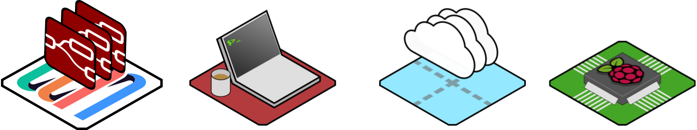
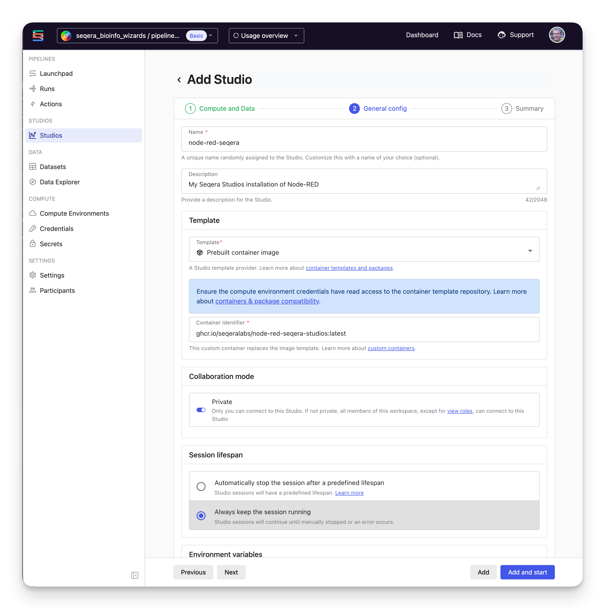
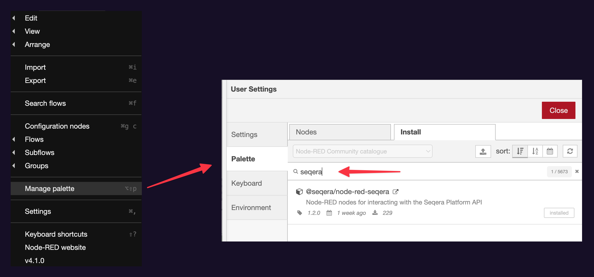

# Installation

## Installing Node-RED

One benefit of Node-RED is that is very lightweight and can be run just about anywhere.

The Node-RED [Getting Started docs](https://nodered.org/docs/getting-started/) include walkthroughs to get Node-RED up and running locally on your laptop, in Docker, on AWS, Azure, even on a Raspberry Pi or an Android device.



<div class="video-wrapper">
<iframe width="560" height="315" src="https://www.youtube.com/embed/bSlNY9dMcQw?si=3J8DLX66E86ITCPz" title="YouTube video player" frameborder="0" allow="accelerometer; autoplay; clipboard-write; encrypted-media; gyroscope; picture-in-picture; web-share" referrerpolicy="strict-origin-when-cross-origin" allowfullscreen></iframe>
</div>

### Using Seqera Studios

In addition to the base Docker image, the repo has an image specifically designed to run within [Seqera Studios](https://seqera.io/platform/studios/), called `ghcr.io/seqeralabs/node-red-seqera-studios` (note `-studios` suffix).

This image comes with Node-RED and the Seqera plugin pre-installed. It also has some light customisation and a welcome screen to help you get started.

!!! tip

    Running within Seqera Studios means that you get authentication and workspace-level
    permissions for free! It's also super easy to get up and running.

To use, add a new Studio with the _Template_ set to _Prebuilt container image_ and enter:

```
ghcr.io/seqeralabs/node-red-seqera-studios:latest
```

Make sure that the studio is set to _Always keep the session running_.



Your new Studio should launch with a complete Node-RED instance that's ready for you to customise and use with Seqera automation.

!!! warning

    Node-RED for production usage needs to be very stable, any disruption in service will break your automation.
    For now, we do not recommend using Seqera Studios for production usage of Node-RED.

### Docker

Seqera-node-red also builds a vanilla docker image, similar to the above but not tailored specifically to Seqera Studios. This can be run anywhere.

This image is designed to be a reference only to get you started only.
You will probably want to customise the `docker/Dockerfile` and `docker/settings.js` files for production usage.

The image can be found at (also with verioned tags):

```
ghcr.io/seqeralabs/node-red-seqera:latest
```

To run, you can use a Docker command such as the following:

```bash
docker run -p 1880:1880 ghcr.io/seqeralabs/node-red-seqera:latest
```

Please note that you will need to mount a local data folder to save progress, or save flows using _Projects_, in case you need to kill the container to upgrade or similar.
See [the Node-RED documentation](https://nodered.org/docs/getting-started/docker) for more details.

## Installing just the seqera-node-red plugin

If you already have Node-RED running somewhere and just want to install the seqera-node-red plugin to get the Seqera nodes, the process is simple:

### Node-RED Palette

Go to _File_ > _Manage Palette_, then the _Install_ tab.
Search for `@seqera/node-red-seqera` (or just "seqera") and click _Install_.



### Via the command line

From within your Node-RED user directory (`~/.node-red`):

```bash
npm install @seqera/node-red-seqera
```
