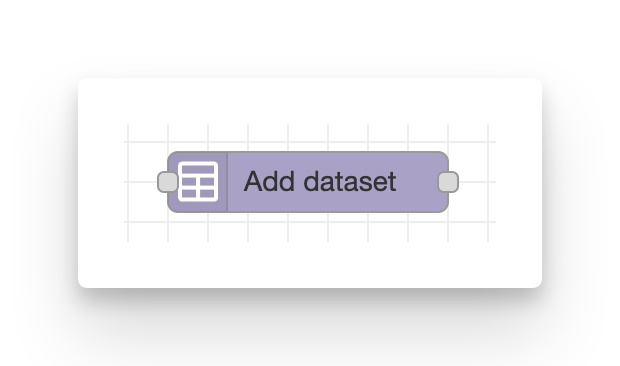
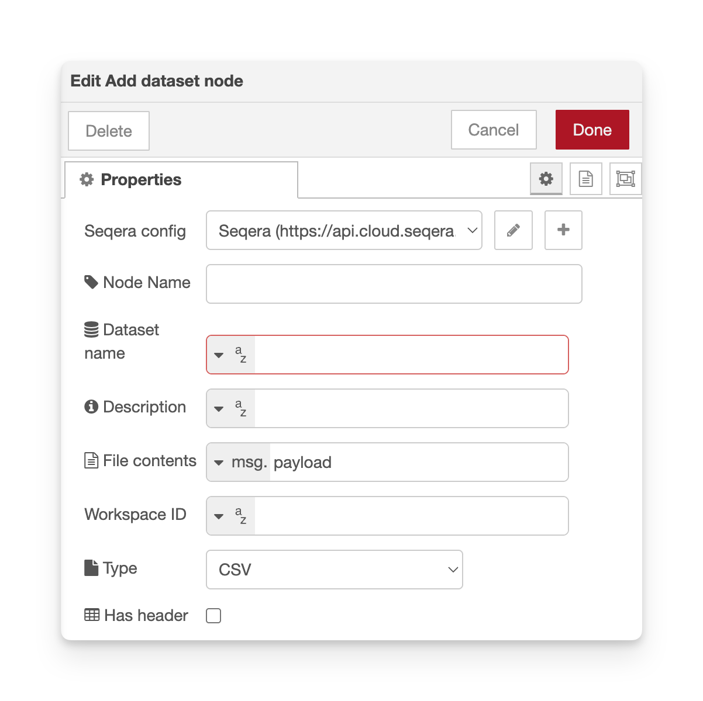

# Add dataset

**Add a new Dataset and upload its tabular contents in one step.**

Datasets in Seqera Platform store tabular data (CSV/TSV files) that can be used as input to workflows, typically containing sample sheets or metadata.

<figure markdown="span">
    { width=400}
    { width=600}
</figure>

## Configuration

-   **Seqera config**: Reference to the seqera-config node containing API credentials and default workspace settings.
-   **Node name**: Optional custom name for the node in the editor.
-   **Dataset name** (required): Name of the Dataset to add.
-   **File contents** (required): CSV/TSV content to upload.
    -   Default `msg.payload`. Can be a string or Buffer.
-   **File type** (`csv` or `tsv`): Determines the MIME type and file extension.
    -   Default `csv`
-   **Description**: Optional description for the Dataset.
-   **Workspace ID**: Override the workspace ID from the Config node.

### File contents

The **File contents** field expects the complete file content as a string or Buffer. You can:

-   Read from a file using the core Node-RED _'read file'_ node
-   Generate dynamically using a _'function'_ node
-   Pass through from a previous node via `msg.payload`

## Outputs

-   `msg.payload` – API response from the upload request.
-   `msg.datasetId` – ID of the newly-added Dataset.

## Required permissions

Minimum required role: **Launch**

See the [configuration documentation](configuration.md#required-token-permissions) for a full table of required permissions for all nodes.

## Example usage

### Generate CSV dynamically

Use a **function** node to create CSV content:

```javascript
const data = [
    ["sample", "fastq_1", "fastq_2"],
    ["sample1", "s3://bucket/sample1_R1.fastq.gz", "s3://bucket/sample1_R2.fastq.gz"],
    ["sample2", "s3://bucket/sample2_R1.fastq.gz", "s3://bucket/sample2_R2.fastq.gz"],
];

msg.payload = data.map((row) => row.join(",")).join("\n");
msg.datasetName = "my-samples-" + new Date().toISOString().split("T")[0];

return msg;
```

Connect this function node to a **add-dataset** node with:

-   **Dataset name**: `msg.datasetName`
-   **File contents**: `msg.payload`

### Add dataset on file upload

See the [Launch on file upload example](../examples/02-launch-on-file-upload.md) for a complete flow that adds a dataset whenever a new file appears in a Data Link.

## Notes

-   Dataset names must be unique within a workspace.
-   The size of the dataset file cannot exceed 10 MB.
-   The uploaded file is validated by Seqera Platform (must be valid CSV/TSV).
-   Custom message properties are preserved in the output (e.g., `msg._context`).
