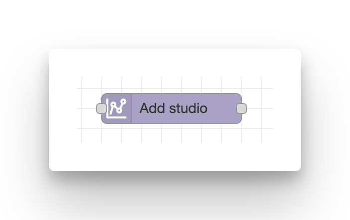
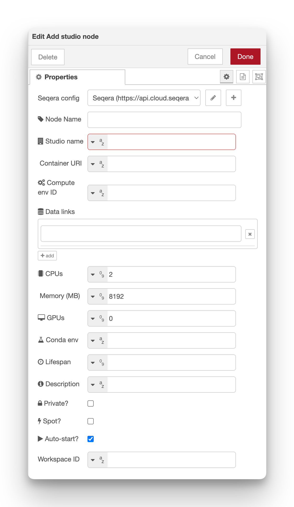

# Add studio

**Add a new Studio (interactive workspace) on Seqera Platform.**

[Seqera Studios](https://docs.seqera.io/platform/latest/studios/overview) provide interactive development environments (like JupyterLab, RStudio, VS Code, Xpra or custom images) running on cloud compute with access to your data.

Trigger a studio addition by passing any event message to the input.

<figure markdown="span">
    { width=400}
    { width=600}
</figure>

## Configuration

-   **Seqera config**: Reference to the seqera-config node containing API credentials and default workspace settings.
-   **Node Name**: Optional custom name for the node in the editor.
-   **Studio name** (required): Display name for the Studio.
-   **Container URI** (required): Container image URI for the Studio tool
    -   See the [Seqera Studios docs](https://docs.seqera.io/platform-cloud/studios/container-images) for details.
    -   The [seqeralabs/custom-studios-examples](https://github.com/seqeralabs/custom-studios-examples) GitHub repository has examples of custom studios Dockerfiles.
-   **Compute env ID** (required): ID of the Compute Environment to run on.
    -   Find the `Id` listed in the Seqera Platforum web UI on the _Compute environments_ listing page.
-   **Data links**: One or more Data Link names to mount inside the Studio. These appear as accessible paths in the Studio environment.
-   **CPUs** (default **2**): Number of CPU cores.
-   **Memory (MB)** (default **8192**): Memory in MB.
-   **GPUs** (default **0**): Number of GPUs.
-   **Conda env**: Conda environment configuration.
-   **Lifespan**: Maximum lifetime before auto-stop (in hours).
-   **Description**: Optional text description for the Studio.
-   **Private?** (default **false**): Whether the Studio is private to the creator.
-   **Spot?** (default **false**): Use spot/preemptible instances.
-   **Auto-start?** (default **true**): Automatically start the Studio after addition.
-   **Workspace ID**: Override the workspace ID from the Config node.

### Mounting data

The **Data links** field accepts an array of Data Link names. Each mounted Data Link appears as a directory inside the Studio, allowing direct access to your cloud storage.

Example:

-   Mount `my-data-link` → appears as `/workspace/my-data-link/` in the Studio

### Lifespan

Set **Lifespan** to automatically stop the Studio after a certain time to control costs. For example:

-   `4` = Stop after 4 hours
-   `24` = Stop after 1 day
-   Empty = No automatic stop (field omitted from API request)

## Outputs

-   `msg.payload` – Full API response from the Studio addition.
-   `msg.studioId` – ID of the added Studio.

## Required permissions

Minimum required role: **Maintain**

See the [configuration documentation](configuration.md#required-token-permissions) for a full table of required permissions for all nodes.

## Example usage

### Add a JupyterLab studio

1. Add an **inject** node to trigger addition
2. Add a **add-studio** node and configure:
    - **Studio name**: `My Notebook`
    - **Container URI**: `public.cr.seqera.io/platform/data-studio-jupyter:4.2.5-0.8`
    - **Compute env ID**: `your-compute-env-id`
    - **CPUs**: `4`
    - **Memory (MB)**: `16384`
    - **Data links**: `["my-datasets", "my-results"]`
3. Add a **debug** node to see the output
4. Deploy and click inject

## Implementation details

The node makes a single API call:

-   `POST /studios` – Adds the Studio with all configuration

The API returns immediately with the Studio ID. The Studio will begin provisioning in the background. Use the [Monitor Studio](monitor_studio.md) node to track when it's ready.

## Notes

-   Studio names must be unique within a workspace
-   Container images must be accessible from the compute environment
-   Data Links must exist before mounting them
-   Set `autoStart: false` if you want to manually start the Studio later
-   Custom message properties are preserved in the output (e.g., `msg._context`)

## See also

-   [Monitor Studio](monitor_studio.md) – Track Studio status
-   [Studio + Slack webhook example](../examples/05-studio-slack-webhook.md) – Complete workflow with notifications
-   [Seqera Studios documentation](https://docs.seqera.io/platform/latest/studios/overview)
