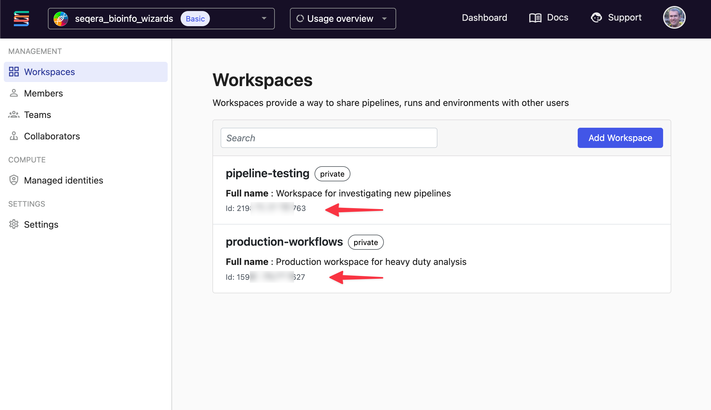

# Seqera Config Node

Create a Seqera Config node to store your API credentials and default settings.

This configuration node is used by all other Seqera Node-RED nodes, so that you only have to enter your Seqera credentials once.

## Configuration properties

- **Base URL**: The base URL for the Seqera API
  - Default: `https://api.cloud.seqera.io`
- **Token**: Your Seqera API token.
  - Create a Seqera access token via [Your Tokens](https://cloud.seqera.io/tokens) in the user menu.
- **Workspace ID**: Your default Seqera workspace ID for running pipelines and studios.
  - If left unset, this will default to your Personal Workspace.

### Finding your Workspace ID

To find the ID, go to the Organisation view listing all Workspaces. Under each one is a 15-digit numeric identifier.

### Required Token Permissions

!!! warning

    For full automation functionality, use a token with the **Maintain** role.

Different operations require different permission levels.

| Node                      | Minimum Role Required |
| ------------------------- | --------------------- |
| Launch workflow           | Maintain              |
| Monitor workflow          | View                  |
| Create Dataset            | Launch                |
| List/Poll Data Link Files | Maintain              |
| Create Studio             | Maintain              |
| Monitor Studio            | View                  |

## Setting up the config node

1. Drag any Seqera node onto the canvas
2. Double-click to edit it
3. Click the pencil icon next to the **Seqera config** dropdown
4. Enter your Base URL, Token, and Workspace ID
5. Click **Add** to save

The configuration node will be available to all Seqera nodes in your flows.

## Multiple configurations

You can create multiple Seqera Config nodes if you need to work with:

- Different Seqera Platform instances (cloud vs. enterprise)
- Multiple workspaces (though the workspace ID can typically be overriden on specific nodes)
- Different API tokens with different permission levels / users

## Security considerations

!!! danger

    Node-RED by design has wide-ranging control over Seqera Platform in order to be able to automate activities. It is your responsibility to manage this risk.

- **Token storage**: API tokens are stored in Node-RED's credentials system and are encrypted at rest
- **Token scope**: Use tokens with the minimum required permissions for your automation
- **Token rotation**: Regularly rotate your API tokens and update the config nodes
- **Access control**: Restrict access to your Node-RED instance to prevent unauthorized use of stored credentials

Node-RED has extensive documentation about securing the Node-RED installation itself,
which should be considered mandatory reading for production usage: [Securing Node-RED](https://nodered.org/docs/user-guide/runtime/securing-node-red).

## Troubleshooting

### Connectivity check

The Seqera Config node includes a connectivity check feature. When editing the Base URL and API Token fields the _Connectivity check_ will attempt to connect to the API and refresh the check status.

### Common issues

**"Unauthorized" errors**:

- Verify your API token is correct and hasn't expired
- Check that the token has sufficient permissions for the operation
- Ensure the token is associated with the correct workspace

**"Workspace not found" errors**:

- Verify the Workspace ID is correct
- Check that your token has access to the specified workspace
- Ensure you're using the workspace ID, not the workspace name

**Connection timeout**:

- Verify the Base URL is correct
- Check your network connectivity
- If using an enterprise installation, ensure the Node-RED instance can reach your Seqera Platform instance

## See also

- [Getting Started](../getting_started.md#seqera-config-node) – Introduction to using the Seqera Config node
- [Seqera Platform Documentation](https://docs.seqera.io/platform/latest/) – Official Seqera Platform docs
- [Creating API Tokens](https://docs.seqera.io/platform/latest/api/overview#authentication) – Guide to creating Seqera API tokens
