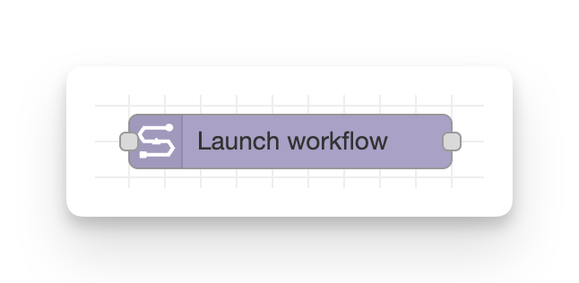
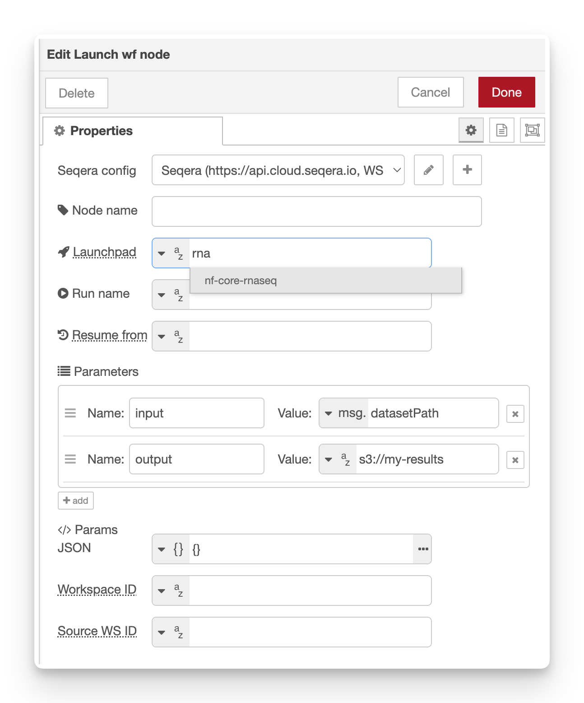

# Launch workflow

**Launch a new workflow (pipeline run) on Seqera Platform.**

Trigger a launch by passing any event message to the input. Configure the pipeline in one or more of the following ways:

1. Within the Seqera Platform launchpad
2. With static values set the node config fields
3. By passing input payloads to the node config fields

<figure markdown="span">
    { width=400}
    { width=600}
</figure>

## Configuration

-   **Seqera config**: Reference to the seqera-config node containing API credentials and default workspace settings.
-   **Node name**: Optional custom name for the node in the editor.
-   **Launchpad**: Name of a Launchpad entry.
    -   The node will look up the pipeline, fetch its default launch configuration and submit the run. Supports autocomplete.
-   **Run name**: Custom name for the workflow run.
    -   Optional - if left blank, Seqera Platform will generate a default name automatically.
-   **Resume from**: Workflow ID (Run ID) from a previous workflow run to resume.
    -   Optional - typically extracted from `msg.workflowId` of a monitored workflow.
-   **Parameters**: Individual parameter key-value pairs configured in the node editor's editable list.
    -   Each parameter can be a string, number, boolean, JSON object, or evaluated from message properties. These take highest precedence when merging.
-   **Params JSON**: A complete JSON object containing multiple parameters.
    -   By default this is a JSON literal (`{}`), but can be changed to read from a message property like `msg.params`. Merged before individual parameters.
-   **Workspace ID**: Override the workspace ID from the Config node.
-   **Source WS ID**: Workspace that owns the source pipeline when launching a shared workflow.

## Outputs

-   `msg.payload` – Raw API response.
-   `msg.workflowId` – Convenience copy of the submitted workflow ID.

## Configuration

### Providing parameters

The workflow-launch node supports two methods for providing parameters:

1. **Params JSON** (`paramsKey`): A JSON object that gets merged into `launch.paramsText`
2. **Parameters list** (`paramsArray`): Individual key-value pairs from editable list (highest precedence)

Parameters from the list take precedence over the Params JSON, allowing you to override specific values while using a base parameter set.
These will be merged over the parameters that are set within the Seqera Platform, in the Launchpad settings.

### Resuming workflows

To resume a failed or cancelled workflow, provide the workflow ID in the **Resume from** field. The node will:

1. Fetch workflow details from `/workflow/{id}`
2. Fetch launch config from `/workflow/{id}/launch` to get the session ID
3. If the previous workflow ran tasks: Set `resume: true` and include `revision` field
4. If workflow was cancelled before any tasks: Set `resume: false` and omit `revision` field

This allows Nextflow to resume from the point of failure rather than restarting from scratch.

!!! tip

    Connect the **Failed** output of a _workflow-monitor_ node to a _workflow-launch_ node with **Resume from** set to `msg.workflowId` to automatically retry failed workflows.
    See the [auto-resume-on-failure example](../examples/03-auto-resume-on-failure.md) to see this in action.

## Required permissions

Minimum required role: **Maintain**

See the [configuration documentation](configuration.md#required-token-permissions) for a full table of required permissions for all nodes.
