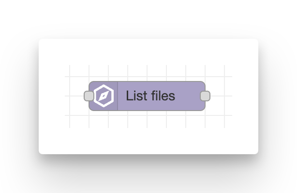
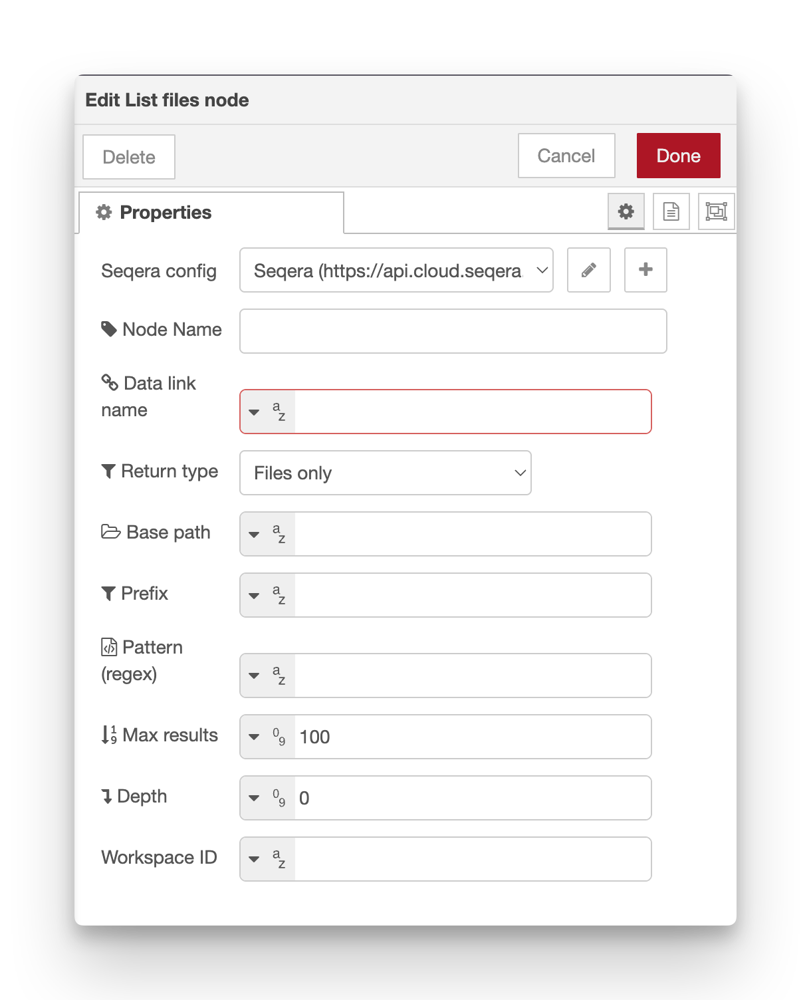

# List files

**Retrieve objects from Seqera Data Explorer (Data Link).**

Data Links provide a way to browse and access files in cloud storage (S3, Azure Blob, Google Cloud Storage, etc.) through the Seqera Platform. This node lists files and folders within a Data Link, with filtering and recursion options.

Trigger a file listing by passing any event message to the input.

<figure markdown="span">
    { width=400}
    { width=600}
</figure>

## Configuration

-   **Seqera config**: Reference to the seqera-config node containing API credentials and default workspace settings.
-   **Node name**: Optional custom name for the node in the editor.
-   **Data Link name** (required): Display name of the Data Link. Supports autocomplete in the node editor.
-   **Base path**: Path within the Data Link to start from (optional).
-   **Prefix**: Prefix filter applied to both files and folders.
-   **Pattern**: Regular-expression filter applied to files _after_ the prefix filter.
-   **Return type** (default **files**): `files`, `folders` or `all`.
-   **Max results** (default **100**): Maximum number of objects to return.
-   **Depth** (default **0**): Folder recursion depth
    -   `0` = current directory only, negative = unlimited.
-   **Workspace ID**: Override the workspace ID from the Config node.

### Filtering

The node provides two filtering mechanisms:

1. **Prefix filter**: Applied to both files and folders. Useful for narrowing to a specific subdirectory or file prefix.
2. **Pattern filter**: Regular expression applied only to files after the prefix filter. Useful for selecting specific file types or naming patterns.

These can be combined, for example:

-   **Prefix**: `samples/batch1/`
-   **Pattern**: `.*\.fastq\.gz$`

This would result in oly `.fastq.gz` files in the `samples/batch1/` directory being listed.

!!! tip

    **Prefix** is preferred, as this is passed to the Seqera Platform API and happens server side.
    **Pattern** is done within Node-RED after results are returned.

### Return type

Choose what objects to return:

-   **files**: Only files (no directories)
-   **folders**: Only directories (no files)
-   **all**: Both files and directories

### Recursion depth

Control how deep to search subdirectories:

-   `0`: Current directory only (no recursion)
-   `1`: Current directory plus one level of subdirectories
-   `2`, `3`, etc.: Multiple levels of recursion
-   `-1`: Unlimited recursion (search all subdirectories)

!!! warning

    Setting depth to `-1` with a large Data Link can result in many API calls and long processing time. Use with caution.

## Outputs

-   `msg.payload.files` – Array of objects returned by the API (after filtering).
-   `msg.payload.resourceType` – Type of the Data Link resource.
-   `msg.payload.resourceRef` – Reference ID of the Data Link.
-   `msg.payload.provider` – Cloud provider (e.g., "aws", "azure", "google").
-   `msg.files` – Convenience array containing fully-qualified object names (strings only).

## Required permissions

Minimum required role: **Maintain**

See the [configuration documentation](configuration.md#required-token-permissions) for a full table of required permissions for all nodes.

## Example usage

### List all CSV files

1. Add an **inject** node to trigger the listing
2. Add a **list-files** node
3. Configure:
    - **Data Link name**: Your Data Link name
    - **Pattern**: `.*\.csv$`
    - **Return type**: `files`
4. Add a **debug** node to see the results
5. Deploy and click inject

### List files in subdirectory

1. Set **Base path**: `data/2024/january/`
2. Set **Depth**: `0`
3. This will list only files directly in that subdirectory

### Recursive search for FASTQ files

1. Set **Pattern**: `.*\.fastq(\.gz)?$`
2. Set **Depth**: `-1`
3. Set **Max results**: `1000` (or appropriate limit)
4. This will recursively find all FASTQ files in the Data Link

### Process results in a loop

Use a **split** node after the list-files node:

1. list-files → split (set to `msg.files`)
2. split → your processing logic (runs once per file)
3. Each iteration receives one file path in `msg.payload`

## Notes

-   Data Link names must match exactly (case-sensitive)
-   The `msg.files` convenience array contains just the file/folder paths as strings
-   The `msg.payload.files` array contains full objects with metadata (size, lastModified, etc.)
-   Custom message properties are preserved in the output (e.g., `msg._context`)
-   Large directories with many files may take time to process with deep recursion

## See also

-   [Poll Data Link Files](poll_files.md) – Automatically monitor a Data Link for new files
-   [Launch on file upload example](../examples/02-launch-on-file-upload.md)
