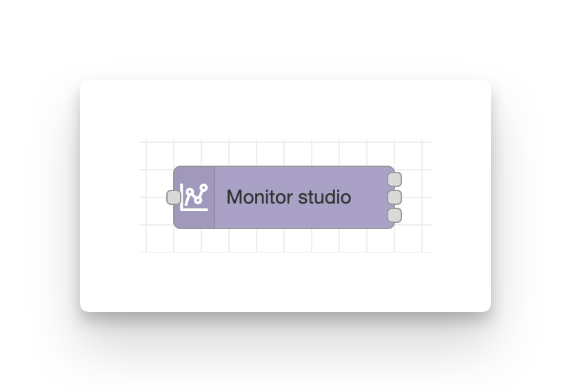
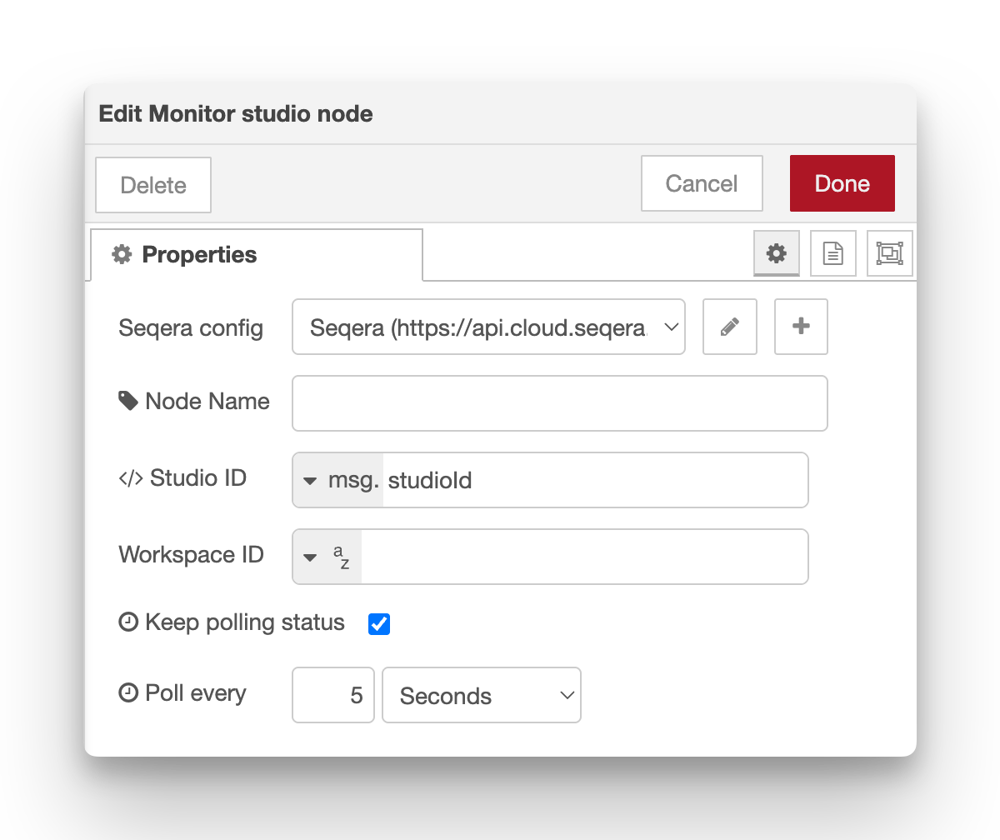
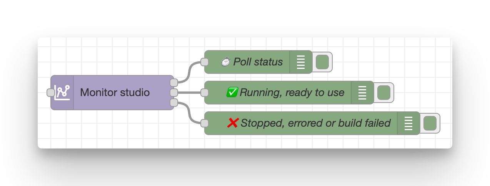

# Monitor studio

**Poll the status of an existing Studio session until it reaches a terminal state.**

This node continuously monitors a Studio's status, allowing you to trigger automation when the Studio becomes ready or terminates.

Trigger by passing an event message to the input handle. Typically this will include a studio ID to track.
The config field Studio ID defaults to `msg.studioId` which is a default output name from the [add studio node](add_studio.md).

<figure markdown="span">
    { width=400}
    { width=600}
</figure>

## Configuration

-   **Seqera config**: Reference to the seqera-config node containing API credentials and default workspace settings.
-   **Node name**: Optional custom name for the node in the editor.
-   **Studio ID** (required): ID of the Studio session to monitor.
    -   Defaults to `msg.studioId`, one of the outputs provided by the [add studio node](add_studio.md).
-   **Workspace ID**: Override the workspace ID from the Config node.
-   **Keep polling status** (default **true**): Continue polling until the Studio reaches a terminal state (stopped, errored, or buildFailed).
-   **Poll interval** (default **5 seconds**): Frequency of status checks. Can be configured in seconds, minutes, or hours.

## Outputs (three)

The monitor node has three separate outputs that fire at different times:

1. **All status checks** – Emitted on every poll regardless of state, for monitoring and logging.
2. **Ready to use** – Emitted **once** when the Studio status transitions to `running` (ready for connections).
3. **Terminated** – Emitted when the Studio is no longer running (`stopped`, `errored`, or `buildFailed`).

<figure markdown="span">
    { width=600}
</figure>

Each message contains:

-   `msg.payload` – Full Studio object from the API, including `statusInfo` with current status details.
-   `msg.studioId` – ID of the Studio session.

### Status Details

The Studio status progression typically follows this sequence:

-   **starting** → Initial provisioning (yellow)
-   **building** → Container image is being built (yellow)
-   **running** → Studio is active and ready to use (blue) - **Output 2 fires here**
-   **stopping** → Shutdown in progress (yellow)
-   **stopped** → Successfully terminated (green) - **Output 3 fires here**
-   **errored** → Runtime error occurred (red) - **Output 3 fires here**
-   **build failed** → Container build failed (red) - **Output 3 fires here**

When **Keep polling status** is disabled, the node performs a single status check and outputs the result immediately without waiting for terminal states.

!!! tip

    Connect Output 2 to subsequent automation (e.g., send a Slack notification when Studio is ready). This output only fires once on the state transition to `running`, making it perfect for triggering actions without duplicate messages.

    Use Output 3 for cleanup or error handling.

## Required permissions

Minimum required role: **View**

See the [configuration documentation](configuration.md#required-token-permissions) for a full table of required permissions for all nodes.

## Example usage

### Send notification when ready

Connect output 2 to a notification service:

1. add-studio → monitor-studio
2. monitor-studio (output 2) → slack notification / email / etc.
3. This notifies users as soon as the Studio is accessible

Example function before notification:

```javascript
msg.payload = `Studio "${msg.payload.name}" is now ready! Connect at: ${msg.payload.connectUrl}`;
return msg;
```

Connect output 3 to a different slack message preparation function to also send notifications that something went wrong with the studio, or that it's been stopped.

## Notes

-   All outputs preserve custom message properties from the input (e.g., `msg._context`)
-   The monitor automatically stops when a terminal state is reached (unless `keepPolling` is false)

## See also

-   [Add Studio](add_studio.md) – Add a new Studio
-   [Studio + Slack webhook example](../examples/05-studio-slack-webhook.md) – Complete workflow with notifications
-   [Seqera Studios documentation](https://docs.seqera.io/platform/latest/studios/overview)
