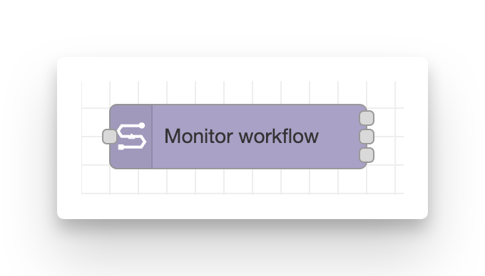
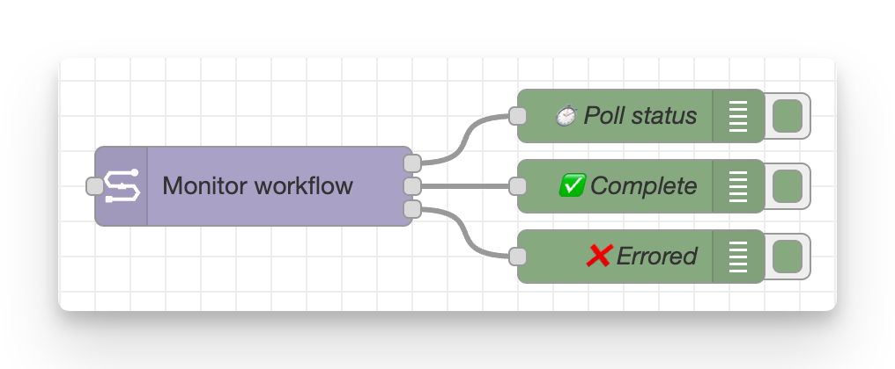

# Monitor workflow

**Poll the status of an existing workflow run until it reaches a terminal state.**

Trigger by passing an event message to the input handle. Typically this will include a workflow ID to track.
The config field Workflow ID defaults to `msg.workflowId` which is a default output name from the [launch workflow node](launch_workflow.md).

<figure markdown="span">
    { width=400}
    { width=600}
</figure>

## Configuration

-   **Seqera config**: Reference to the seqera-config node containing API credentials and default workspace settings.
-   **Node name**: Optional custom name for the node in the editor.
-   **Workflow ID** (required): ID of the workflow to monitor.
    -   Defaults to `msg.workflowId`, one of the outputs provided by the [launch workflow node](launch_workflow.md).
-   **Workspace ID**: Override the workspace ID from the Config node.
-   **Keep polling status** (default **true**): Continue polling until the workflow is finished.
-   **Poll interview** (default **5 seconds**): Frequency of status checks.

## Outputs (three)

The monitor node has three separate outputs that fire at different times:

1. **Active**: Emitted on every poll while the workflow is in `submitted` or `running`.
2. **Succeeded**: Emitted once when the workflow reaches a success status (`succeeded`).
3. **Failed**: Emitted once for any terminal non-success status (`failed`, `cancelled`, `unknown`).

<figure markdown="span">
    
</figure>

Each message contains:

-   `msg.payload` (object): Full workflow object from the API.
-   `msg.workflowId` (string): Convenience copy of the workflow ID.

## Required permissions

Minimum required role: **View**.

See the [configuration documentation](configuration.md#required-token-permissions) for a full table of required permissions for all nodes.

## Notes

-   The monitor stops polling automatically when a terminal state is reached
-   All three outputs preserve custom message properties from the input (e.g., `msg._context`)
-   For long-running workflows, consider increasing the poll interval to reduce API calls
