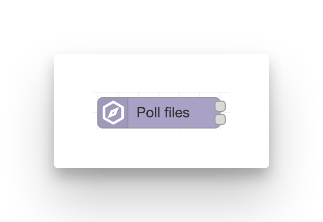
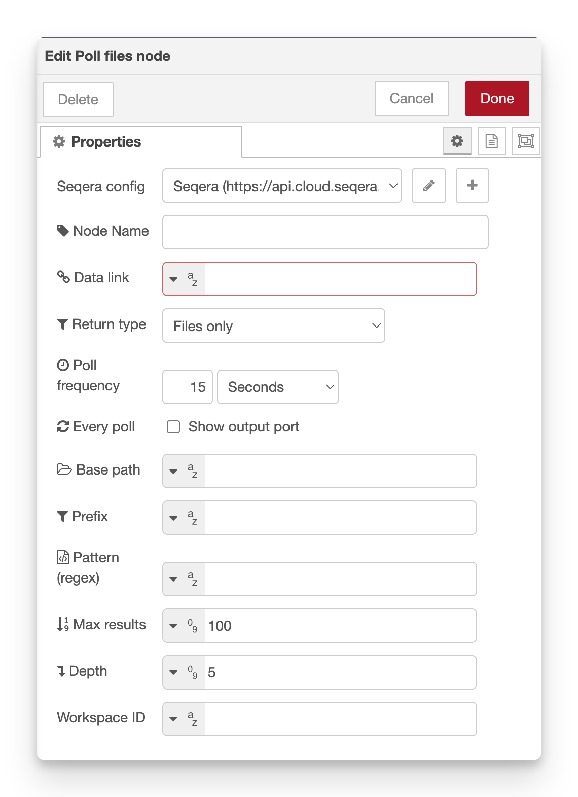

# Poll files

**Periodically list a Seqera Data Explorer Data Link and emit messages when new objects appear.**

This node automatically monitors a Data Link for changes, making it perfect for event-driven workflows that trigger when new files are uploaded.

!!! note

    The node starts polling as soon as the flow is deployed – it has **no message inputs**.

<figure markdown="span">
    { width=400}
    { width=600}
</figure>

## Configuration

-   **Seqera config**: Reference to the seqera-config node containing API credentials and default workspace settings.
-   **Node name**: Optional custom name for the node in the editor.
-   **Data Link name** (required): Display name of the Data Link. Supports autocomplete.
-   **Base path**: Path within the Data Link to start from.
-   **Prefix**: Prefix filter applied to both files and folders.
-   **Pattern**: Regular-expression filter applied to files after the prefix filter.
-   **Return type** (default **files**): `files`, `folders` or `all`.
-   **Max results** (default **100**): Maximum number of objects to return per poll.
-   **Depth** (default **0**): Folder recursion depth.
-   **Poll frequency** (default **15 min**): Interval between polls.
-   **Workspace ID**: Override the workspace ID from the Config node.

All properties work the same as the [list files](list_files.md) node, plus automatic polling.

### Poll frequency format

The **Poll frequency** field accepts several formats:

-   **Seconds only**: `90` (90 seconds)
-   **MM:SS**: `05:30` (5 minutes, 30 seconds)
-   **HH:MM:SS**: `01:30:00` (1 hour, 30 minutes)
-   **DD-HH:MM:SS**: `01-12:00:00` (1 day, 12 hours)

Examples:

-   `30` = 30 seconds
-   `10:00` = 10 minutes
-   `1:00:00` = 1 hour
-   `00-01:00:00` = 1 hour

## Outputs (two)

The node has two outputs that fire at different times:

1. **All results** – Emitted every poll with the full, filtered list of files.
2. **New results** – Emitted only when one or more _new_ objects are detected since the last poll.

Both messages include the same properties:

-   `msg.payload.files` – Array of file objects from the API.
-   `msg.payload.resourceType`, `msg.payload.resourceRef`, `msg.payload.provider` – Data Link metadata.
-   `msg.files` – Convenience array of fully-qualified object names (strings).
-   `msg.payload.nextPoll` (only on **All results** output) – ISO timestamp of the next scheduled poll.

## How new files are detected

The node tracks seen files in its context storage. On each poll:

1. Fetch the current list of files from the Data Link
2. Compare against the list from the previous poll
3. If new files are found, emit them on output 2
4. Update the stored list for the next comparison

The comparison is based on the full file path. Files that are deleted and re-uploaded will be detected as "new".

## Required permissions

Minimum required role: **Maintain**

See the [configuration documentation](configuration.md#required-token-permissions) for a full table of required permissions for all nodes.

## Example usage

### Launch workflow on new files

1. Add a **poll-files** node and configure the Data Link
2. Set **pollFrequency** to your desired interval (e.g., `5:00` for 5 minutes)
3. Connect output 2 (New results) to a **workflow-launch** node
4. Configure the launch node to use the file paths from `msg.files`
5. Deploy

Now every time a new file appears in the Data Link, a workflow will automatically launch.

### Monitor with notifications

1. poll-files (output 1) → function node:
    ```javascript
    msg.payload = `Found ${msg.files.length} files. Next poll: ${msg.payload.nextPoll}`;
    return msg;
    ```
2. function → debug node

This shows the current file count and next poll time on every check.

### Trigger only on specific file types

1. Set **pattern**: `.*\.bam$` to only detect BAM files
2. Connect output 2 to your processing logic
3. The node will only emit when new BAM files appear

## Implementation details

The node uses Node-RED's context storage to persist the list of seen files between deployments. This means:

-   The tracking survives Node-RED restarts
-   Each poll-files node maintains its own independent state
-   Deleting and re-adding the node will reset the tracking (all files will appear "new" on first poll)

## Notes

-   The first poll after deployment considers all matching files as "new"
-   To reset the tracking, delete and re-add the node
-   Very frequent polling (< 30 seconds) may impact API rate limits
-   The node status shows the last poll time and next poll time
-   Custom message properties are preserved in outputs (e.g., `msg._context`)
-   Large Data Links with deep recursion may take time to process on each poll

## Best practices

-   Set **pollFrequency** based on how quickly you need to respond to new files
    -   For near-real-time: `30` seconds to `2:00` minutes
    -   For batch processing: `15:00` to `1:00:00`
    -   For daily checks: `24:00:00`
-   Use **prefix** to narrow the search space and reduce API calls
-   Set **maxResults** high enough to capture all expected files per poll
-   Consider the trade-off between poll frequency and API usage

## See also

-   [List Files from Data Explorer](list_files.md) – One-time file listing
-   [Launch on file upload example](../examples/02-launch-on-file-upload.md) – Complete flow using this node
