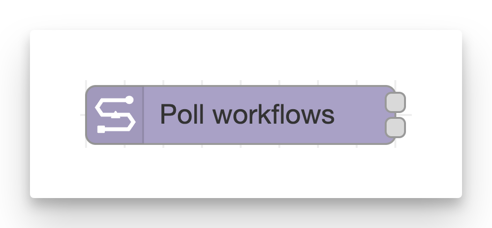
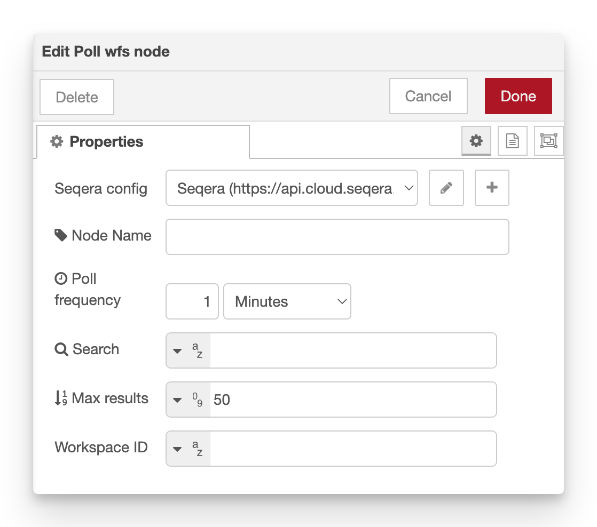

# Poll workflows

**Periodically list workflow runs from Seqera Platform and emit messages when new workflows are detected.**

This node automatically monitors your workspace for _new workflow runs_. Trigger events when new pipelines are launched by other users or systems.

!!! note

    The node starts polling as soon as the flow is deployed – it has **no message inputs**.

<figure markdown="span">
    { width=400}
    { width=600}
</figure>

## Configuration

-   **Seqera config**: Reference to the seqera-config node containing API credentials and default workspace settings.
-   **Node name**: Optional custom name for the node in the editor.
-   **Poll frequency** (default **1 minute**): Interval between polls. Can be configured in seconds, minutes, hours, or days.
-   **Search**: Optional search filter for workflow names. Leave blank to include all workflows. Supports TypedInput (msg, flow, global, env, JSONata).
-   **Max results** (default **50**): Maximum number of workflow runs to fetch per poll. Supports TypedInput.
-   **Workspace ID**: Override the workspace ID from the Config node. Supports TypedInput.

## Outputs (two)

The node has two outputs that fire at different times:

1. **All results** – Emitted once per poll with the full, filtered list of workflows.
2. **New workflows** – Emitted once **per new workflow** detected since the last poll. If 3 new workflows are found, this output fires 3 separate times.

### Output 1: All results

Emitted on every poll cycle with a single message:

-   `msg.payload.workflows` – Array of workflow objects from the API (full workflow details).
-   `msg.payload.nextPoll` – ISO timestamp of the next scheduled poll.
-   `msg.workflowIds` – Convenience array of workflow ID strings.

### Output 2: New workflows

Emitted once per new workflow detected. Each message contains:

-   `msg.payload.workflow` – Single workflow object from the API.
-   `msg.workflowId` – The workflow ID string.

!!! tip

    Connect output 2 to the [monitor workflow](monitor_workflow.md) node and it will start monitoring the new workflow run without further configuration.

## How new workflows are detected

The node tracks seen workflow IDs in its context storage. On each poll:

1. Fetch the current list of workflows from Seqera Platform
2. Compare workflow IDs against the list from the previous poll
3. For each new workflow ID, emit a separate message on output 2
4. Update the stored list for the next comparison

The comparison is based on the unique `workflow.id` field.

!!! info

    The very first poll after the node is created sees everything as new and is handled as a special case. It does not output new results to avoid flooding downstream nodes on initialization.

## Required permissions

Minimum required role: **View**

See the [configuration documentation](configuration.md#required-token-permissions) for a full table of required permissions for all nodes.

## Example usage

### Monitor specific pipelines

1. Add a **poll-workflows** node to your flow
2. Set **search** to filter by pipeline name (e.g., `nf-core/rnaseq`)
3. Connect output 2 to a **workflow-monitor** node to track progress
4. Chain additional automation based on workflow status

### Send Slack notifications for new runs

1. Add a **poll-workflows** node
2. Connect output 2 to a function node that formats a Slack message:
    ```javascript
    msg.payload = {
        text: `New workflow launched: ${msg.payload.workflow.workflow.runName} (${msg.workflowId})`,
    };
    return msg;
    ```
3. Connect to a Slack webhook node
4. Deploy

### Comparison with Monitor Workflow node

-   **Poll Workflows**: Discovers _new_ workflows automatically by polling the workspace
-   **Monitor Workflow**: Tracks the status of a _specific_ workflow you already know about

Use Poll Workflows when you want to react to workflows launched by others. Use Monitor Workflow when you want to track a workflow you just launched.

## See also

-   [Monitor Workflow](monitor_workflow.md) – Track status of a specific workflow
-   [Launch Workflow](launch_workflow.md) – Launch a new workflow
-   [Poll Data Link Files](poll_files.md) – Monitor Data Links for new files
