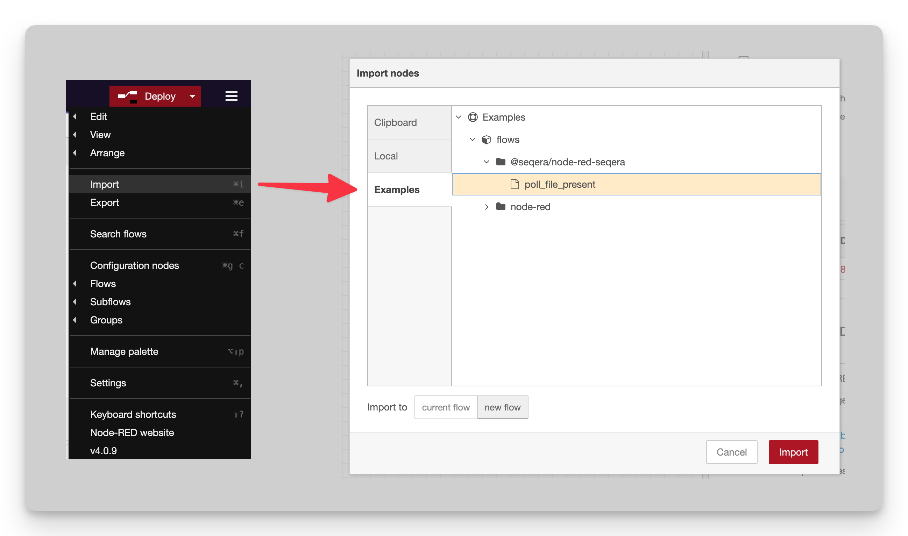
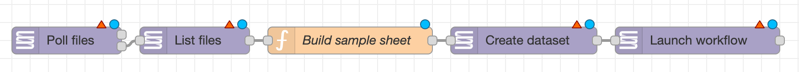
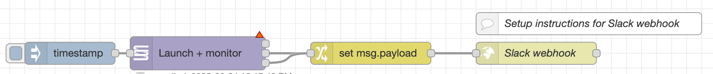
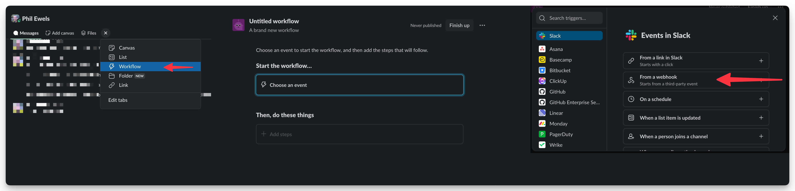

# Node-RED + Seqera: Examples

You can find the Seqera nodes in the sidebar on the left, under the heading "Seqera". To jump-start your development, take a look at the examples that come with the extension:

- Menu (top right `≡` button)
- Import
- Examples (modal's left sidebar)
- @seqera/node-red-seqera dropdown
- Choose an example and import into your current workflow

## Launch on file upload

`examples/poll_file_present.json`

This flow uses the _Poll files_ node to periodically check for the presence
of a file called `RTAcomplete.txt` within a Seqera Data Link (eg. an s3 bucket).

These files are typically uploaded by illumina sequencers when base calling is complete.
But you could configure it to look for the upload of any file path.

When the file is detected, a _List files_ node is used to list all of the files within
that Data Link (bucket - could be configured to use the location that the `RTAcomplete.txt` file is found).

A Node-RED _Function_ node with some javascript then constructs a sample sheet from these filenames.
This is passed to the "Create Dataset" node, which saves it as a Seqera Platform Dataset.

Finally, this is passed to the _Launch workflow_ node, which fires off a pipeline run.

Some configuration is needed to make this flow work:

- All Seqera nodes need a Seqera configuration to be assigned
- _Poll files_ and _List files_ need to be configured with the name of a Data Link within Platform
- _Create dataset_ needs a dataset name to be set somehow (dynamically to avoid name clashes)
- _Launch workflow_ needs configuring with the name of a Launchpad pipeline, and parameters.

## Slack webhook

`slack_webook.json`

This is a very simple workflow to show how workflow monitoring can be hooked up to outgoing webhook URLs.
In this case, we use a Slack webhook, which can be easily created using Slack Workflows.

Workflow success and failure will create a message in Slack with the workflow name, run name, status and a button that links to the Platform run details page.

This workflow can easily be extended to use different behaviour for successful and failing workflows.

Some configuration is needed to make this flow work:

- All Seqera nodes need a Seqera configuration to be assigned
- You'll need to create the external webhook (see below)

#### Creating the webhook in Slack

To make the automated Slack message, first you need to create a Slack Workflow.
Selelct _"From a webhook"_ as the trigger:

Then configure with some input variables and a button, and copy the webhook URL. You'll need this later!

